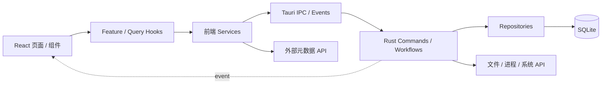

# 架构总览

ReinaManager 是 React 前端与 Rust 后端组成的 Tauri 2 桌面应用。本页只描述系统边界和主路径；实现细节由下方专题文档继续分发。

## 系统边界



主要职责：

- React 负责界面、用例编排、查询缓存和外部元数据整合。
- Rust 负责本地持久化、文件系统、游戏进程、安装任务、备份、OAuth 和桌面集成。
- SQLite 是核心业务数据的事实源。TanStack Query 缓存这些事实，Zustand 保存 UI 状态和用户偏好。

该图是常规路径，不是全局严格分层。安装、备份、OAuth 和游戏启动会直接组合 repository、SeaORM entity、文件系统、HTTP 或 Tauri event。

## 目录地图

```text
src/
├── pages/              路由页面与页面私有逻辑
├── components/         跨页面 UI 组件
├── hooks/queries/      Query key、query、mutation、缓存策略
├── hooks/features/     用例级编排
├── services/invoke/    Tauri IPC 边界
├── services/           文件、运行时、认证、云端等工作流
├── metadata/           外部元数据源适配与合并
├── store/              Zustand 客户端状态
└── providers/          Router、Query、i18n 和主题

src-tauri/
├── src/                Tauri/Rust 应用代码
├── migration/          SeaORM 顺序迁移 crate
├── reina-path/         标准/便携模式路径策略
└── capabilities/       Tauri 权限声明
```

## 通信方式

- **IPC command**：有明确请求和响应的本地操作。前端统一经 `src/services/invoke` 调用。
- **Tauri event**：后端主动推送安装进度、游戏会话和 OAuth 结果。
- **Tauri HTTP**：前端元数据子系统经 `@tauri-apps/plugin-http` 访问外部 API。
- **自定义协议**：图片/封面协议向 WebView 提供本地资源；`reinamanager://` 接收安装请求。

## 启动主路径

```text
main.rs → lib::run
→ 注册协议、插件、State 和 Commands
→ 日志与旧文件迁移
→ 建立 SQLite 并执行 SeaORM migrations
→ 恢复中断安装任务
→ 前端初始化 Zustand、计时、托盘和路径缓存
→ 挂载 React
```

数据库连接或 schema migration 失败会停止启动，避免应用在未知 schema 上继续运行。

## 继续阅读

- React 分层和状态边界：[`frontend.md`](frontend.md)
- Rust 模块和存储：[`backend.md`](backend.md)
- 游戏库缓存与索引：[`game-library.md`](game-library.md)
- 外部元数据适配：[`metadata.md`](metadata.md)
